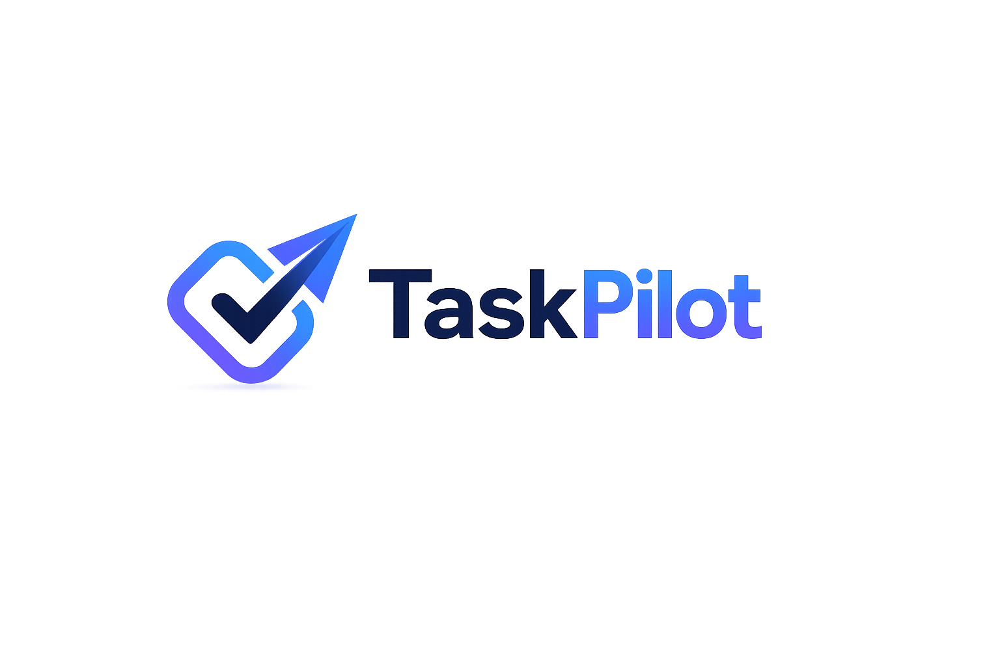

🚀 TaskPilot

Modern Project Management & Team Collaboration Platform

Manage projects, tasks, teams, deadlines, workspaces, analytics, and productivity — all in one place.

Built with scalability, performance, collaboration, and developer experience in mind.

Live Demo: https://taskpilot-tan.vercel.app

⸻

📖 Overview

TaskPilot is a modern full-stack project management platform inspired by industry-leading productivity tools such as Jira, Linear, Trello, ClickUp, and Monday.com.

It enables teams to organize work efficiently through workspaces, projects, task assignments, role-based collaboration, analytics dashboards, calendar management, and productivity tracking.

The platform is designed with a clean architecture, scalable backend infrastructure, responsive UI, secure authentication, and real-time team collaboration capabilities.

TaskPilot aims to provide a professional project management experience while maintaining simplicity, speed, and ease of use.

⸻

✨ Features

🏢 Workspace Management

* Create multiple workspaces
* Separate teams and projects
* Invite members using invite links
* Manage workspace settings
* Workspace-specific analytics
* Workspace image support
* Role-based access control

⸻

📂 Project Management

* Create unlimited projects
* Project image uploads
* Edit project details
* Delete projects
* Project-specific dashboards
* Project analytics
* Organized project navigation

⸻

✅ Task Management

* Create tasks
* Update tasks
* Delete tasks
* Assign tasks to members
* Set task priorities
* Set due dates
* Track task status
* Organize project workflows

⸻

📊 Analytics Dashboard

Comprehensive productivity metrics:

* Total Tasks
* Completed Tasks
* Pending Tasks
* Overdue Tasks
* Assigned Tasks
* Monthly Progress Tracking
* Workspace Analytics
* Project Analytics

⸻

👥 Team Collaboration

* Invite members
* Join workspaces via invite code
* Manage workspace members
* Member roles
* Administrator controls
* Team management system

⸻

🔐 Authentication & Security

Email Authentication

* Secure user registration
* Login system
* Session management

OAuth Authentication

* Google Login
* GitHub Login

Security Features

* Protected routes
* Session validation
* Role-based authorization
* Secure API architecture
* Environment variable protection

⸻

📅 Calendar Integration

Task scheduling through:

* Calendar view
* Deadline tracking
* Due date management
* Productivity planning

⸻

🎨 Modern UI/UX

* Responsive design
* Mobile-friendly layouts
* Clean dashboard experience
* Smooth navigation
* Modern component architecture
* Accessible UI patterns
* Consistent design language

⸻

🏗️ System Architecture

┌─────────────────────┐
│      Frontend       │
│      Next.js        │
└──────────┬──────────┘
           │
           ▼
┌─────────────────────┐
│      Hono APIs      │
│ Route Handlers/API  │
└──────────┬──────────┘
           │
           ▼
┌─────────────────────┐
│      Appwrite       │
│ Auth • DB • Storage │
└──────────┬──────────┘
           │
           ▼
┌─────────────────────┐
│      Vercel         │
│    Deployment       │
└─────────────────────┘

⸻

⚡ Tech Stack

Frontend

* Next.js 14
* React 18
* TypeScript
* Tailwind CSS
* React Hook Form
* Zod
* TanStack Query
* ShadCN UI
* Lucide Icons

⸻

Backend

* Hono
* TypeScript
* Appwrite SDK

⸻

Database

* Appwrite Database

Collections:

* Users
* Workspaces
* Members
* Projects
* Tasks

⸻

Authentication

* Appwrite Auth
* Google OAuth
* GitHub OAuth
* Session Cookies

⸻

Storage

* Appwrite Storage
* Workspace Images
* Project Images

⸻

Deployment

* Vercel
* GitHub Actions Ready

⸻

🧩 Core Modules

Authentication Module

Handles:

* Registration
* Login
* Logout
* OAuth Login
* Session Management

⸻

Workspace Module

Handles:

* Workspace Creation
* Member Invitations
* Settings
* Analytics
* Workspace Images

⸻

Project Module

Handles:

* Project CRUD Operations
* Analytics
* Image Uploads

⸻

Task Module

Handles:

* Task CRUD Operations
* Assignment Logic
* Status Updates
* Due Dates
* Filtering

⸻

Analytics Module

Handles:

* Productivity Reports
* Monthly Comparisons
* Completion Metrics
* Overdue Tracking

⸻

📊 Database Design

Workspaces

Workspace
│
├── Members
├── Projects
└── Analytics

⸻

Projects

Project
│
├── Tasks
├── Analytics
└── Members

⸻

Tasks

Task
│
├── Assignee
├── Status
├── Due Date
└── Project

⸻

📈 Performance Optimizations

Implemented optimizations include:

* Server Components
* Dynamic Rendering
* API Route Segmentation
* Lazy Loading
* Optimized Images
* Query Caching
* Minimal Re-renders
* Modular Architecture

⸻

🔒 Security Considerations

Authentication

* Session-based Authentication
* OAuth Authentication
* Protected Routes

Authorization

* Workspace Validation
* Membership Validation
* Admin Verification

Infrastructure

* Environment Variables
* Secure Appwrite APIs
* Access-Control Protection

⸻

🌍 Real World Use Cases

Software Teams

* Sprint Planning
* Bug Tracking
* Feature Management

Startups

* Product Roadmaps
* Team Collaboration
* Internal Operations

Agencies

* Client Projects
* Team Assignments
* Delivery Tracking

Students

* Group Projects
* Research Management
* Assignment Planning

Freelancers

* Client Management
* Project Tracking
* Productivity Monitoring

⸻

📱 Responsive Design

Supports:

* Desktop
* Laptop
* Tablet
* Mobile Devices

⸻

🚀 Deployment

Production

Hosted on:

https://taskpilot-tan.vercel.app

⸻

Backend Services

Appwrite Cloud

⸻

🛠️ Local Development

Clone Repository

git clone https://github.com/your-username/taskpilot.git

Install Dependencies

npm install

Configure Environment Variables

NEXT_PUBLIC_APP_URL=
NEXT_PUBLIC_APPWRITE_ENDPOINT=
NEXT_PUBLIC_APPWRITE_PROJECT=
NEXT_PUBLIC_APPWRITE_DATABASE_ID=
NEXT_PUBLIC_APPWRITE_WORKSPACES_ID=
NEXT_PUBLIC_APPWRITE_MEMBERS_ID=
NEXT_PUBLIC_APPWRITE_PROJECTS_ID=
NEXT_PUBLIC_APPWRITE_TASKS_ID=
NEXT_PUBLIC_APPWRITE_IMAGES_BUCKET_ID=
NEXT_APPWRITE_KEY=

Run Development Server

npm run dev

Production Build

npm run build
npm start

⸻

🧪 Future Enhancements

Planned Features

* Real-Time Collaboration
* Activity Feed
* Team Chat
* Notifications
* AI Task Suggestions
* AI Sprint Planning
* AI Productivity Insights
* File Attachments
* Comments System
* Kanban Board
* Gantt Charts
* Team Reporting
* Dark Mode
* Time Tracking
* Workspace Templates
* Recurring Tasks
* Mobile App

⸻

🎯 Key Engineering Highlights

* Full Stack TypeScript
* Server Components
* Modern App Router
* Scalable Architecture
* Modular Feature Structure
* Strong Type Safety
* Schema Validation
* Role-Based Access Control
* Cloud Native Infrastructure
* Production Ready Deployment

⸻

📂 Project Structure

src
│
├── app
├── components
├── config
├── features
│   ├── auth
│   ├── members
│   ├── projects
│   ├── tasks
│   └── workspaces
│
├── hooks
├── lib
├── providers
└── types

⸻

👨‍💻 Author

Rishabh Kumar

Software Developer • Full Stack Engineer • AI Engineer

Focused on building scalable web applications, modern SaaS products, AI-powered systems, and production-grade software solutions.

⸻

⭐ Support

If you found this project useful:

* Star the repository
* Fork the project
* Share feedback
* Contribute improvements

⸻

Built with ❤️ using Next.js, TypeScript, Appwrite, Hono, Tailwind CSS and Vercel

TaskPilot — Navigate Projects. Deliver Faster.

</
